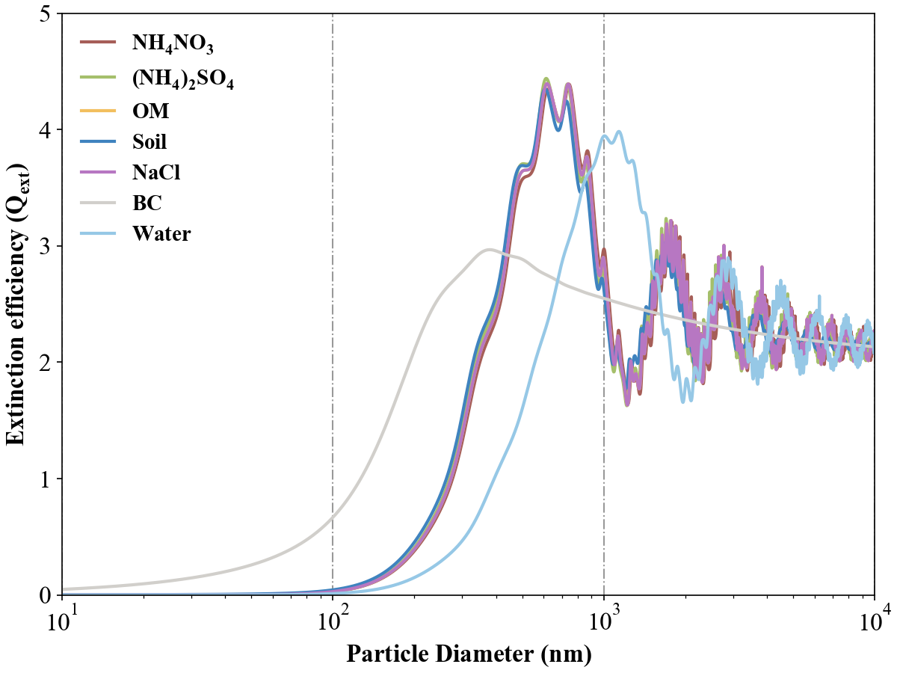
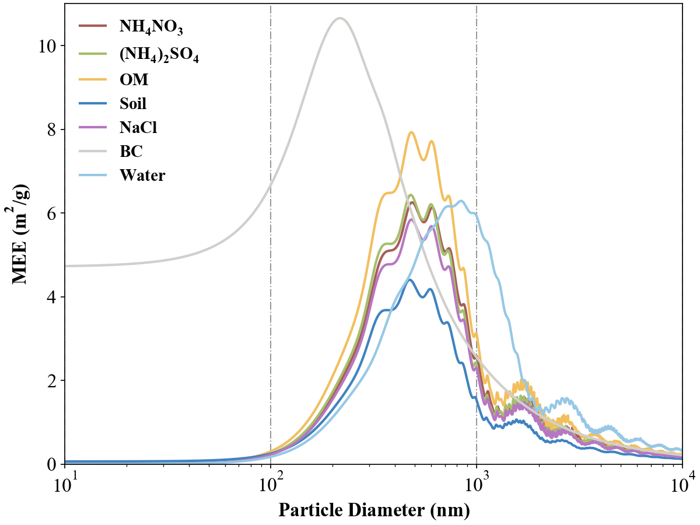
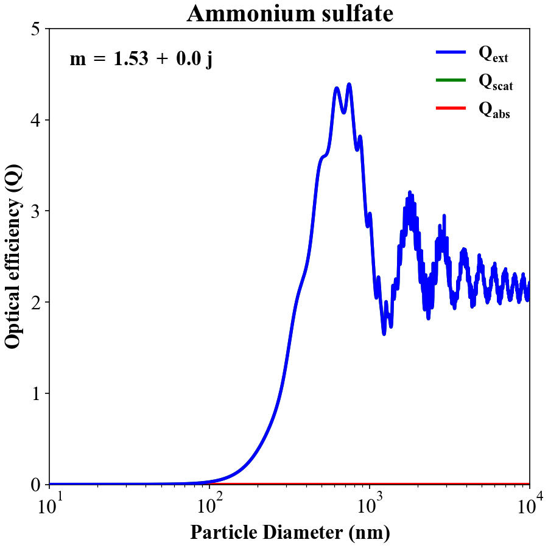
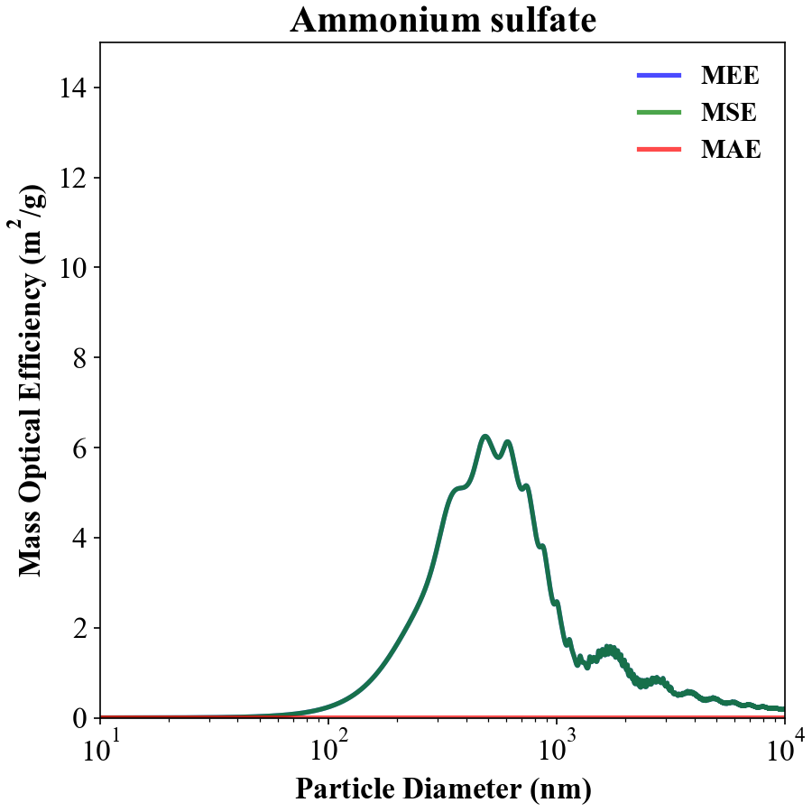
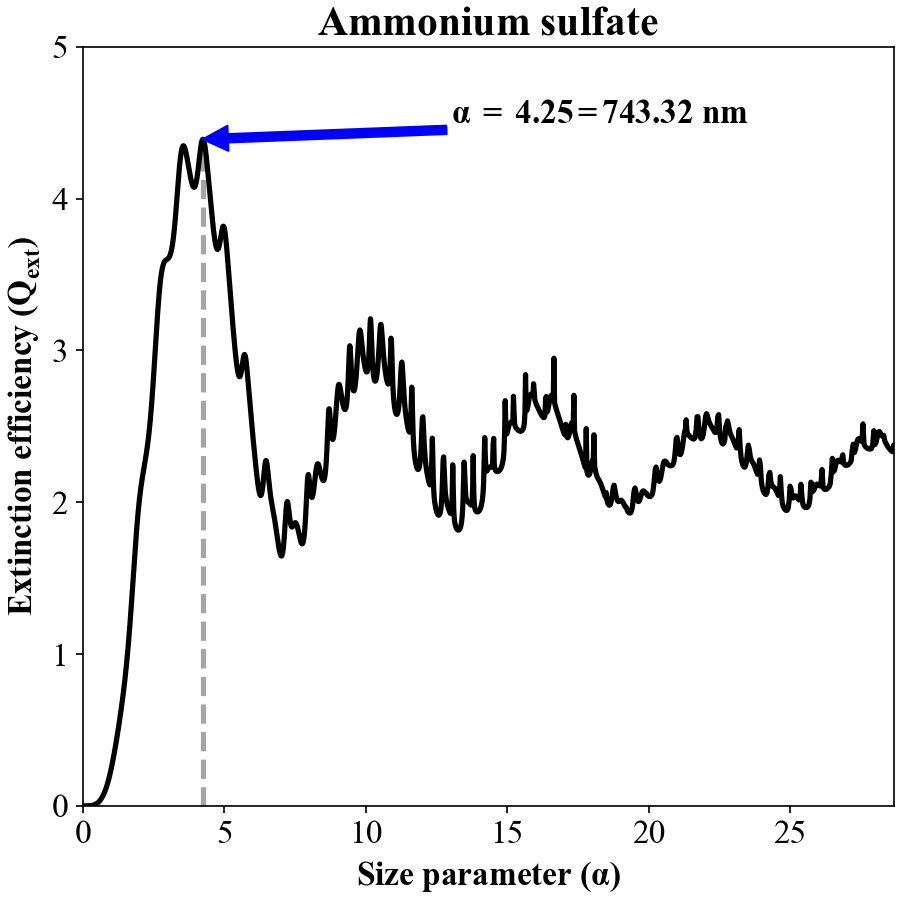
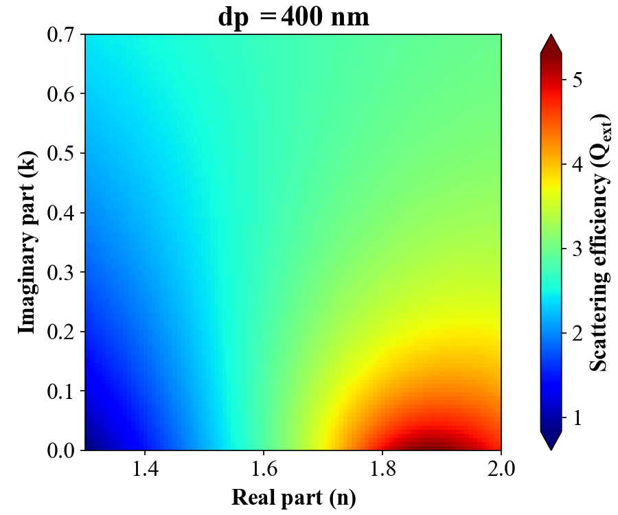
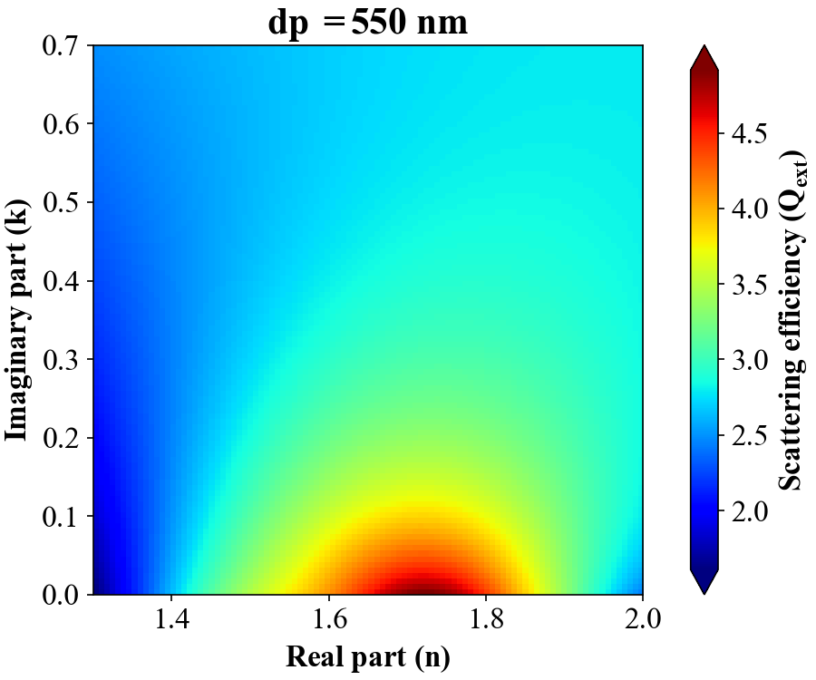
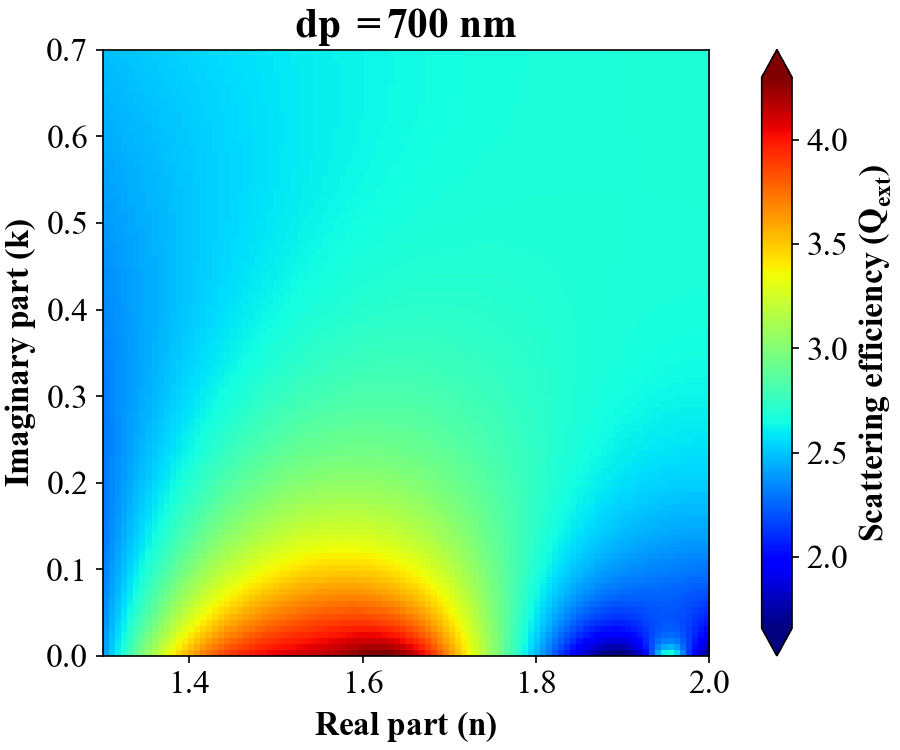

# Mie_plot
This code aims to visualize the single-particle extinction efficiency (Q), and mass scattering efficiency (MEE) in different particle size or size parameters.

In the Mie_plot_main, I establish each chemical species' refractive indexes (RI) and density. Then, I use these parameters to plot the following figures. 

## All_species_Q

## All_species_MEE

## Q_plot, MEE_plot, Q_size_parameter
|--------## Q_plot------------|---------------------------------|----------------------------------|
|  |  |  |
|------------------------------------------|------------------------------------------|------------------------------------------|

## RRI_2D
|  |  |  |
|------------------------------------------|------------------------------------------|------------------------------------------|
